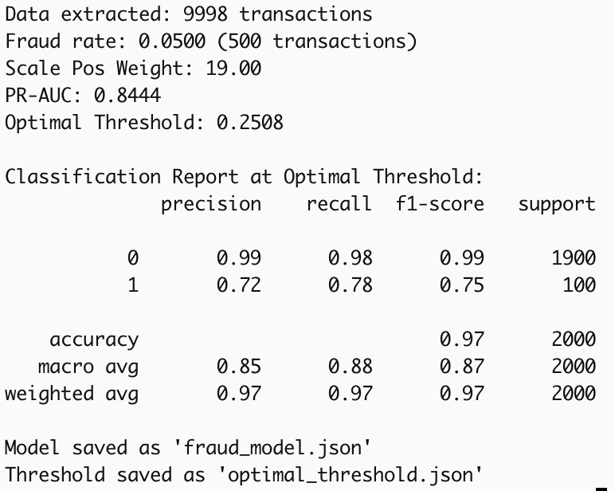
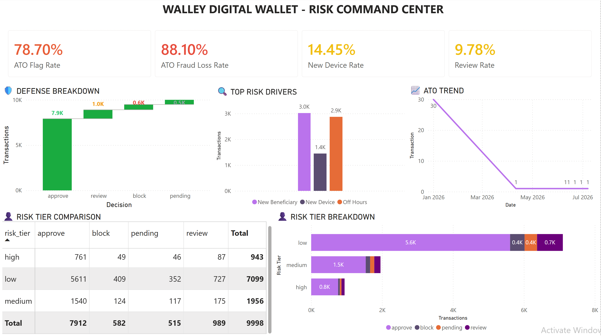
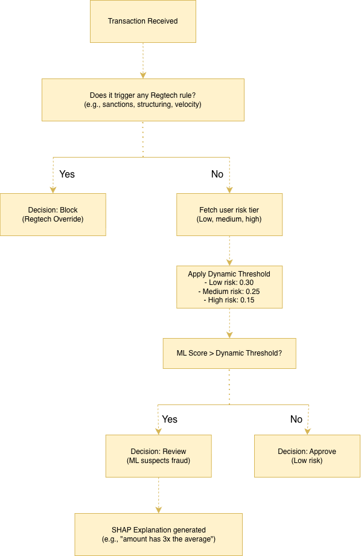
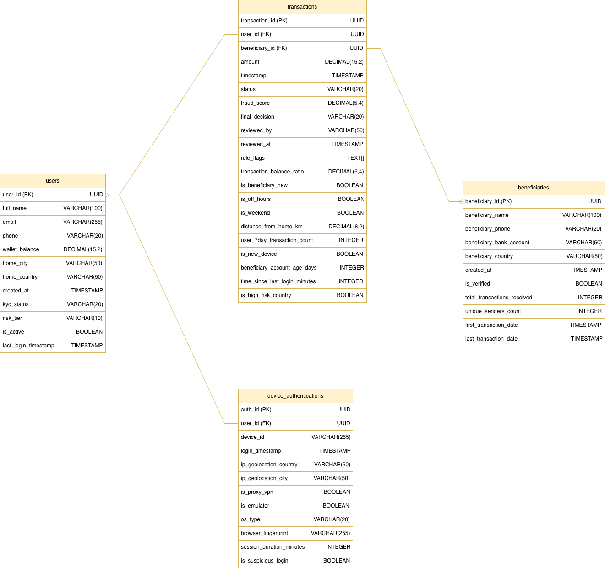

# Walley: Stopping Account Takeover Fraud in a Vietnamese Digital Wallet

---

## 📖 The Story

Walley is a Vietnamese digital wallet that allows users to send money, pay bills, and withdraw cash. As the business grew, so did fraud—specifically, **Account Takeover (ATO)**. Fraudsters steal customer credentials, log in, and drain the wallet before the user even knows what happened.

**The problem was clear:**
- Our rule-based system was catching obvious fraud (like structuring or velocity violations)
- But it was **blind to sophisticated ATO attacks** where fraudsters used legitimate credentials
- Customers were complaining about declined transactions
- Investigators were overwhelmed with false alarms
- Fraud losses were climbing

**The regulatory pressure was real:**
- **SBV Decision 2345** (State Bank of Vietnam) mandates biometric authentication for any transaction over 10,000,000 VND
- Fraudsters were intentionally structuring transactions just below this threshold to avoid detection
- **FATF guidelines** require monitoring of high-risk countries
- We needed a system that could **think like a fraudster**, not just follow rules

---

## 🎯 The Objective

We needed to build a system that could:

1. **Detect ATO fraud** that rules alone could not catch
2. **Stay compliant** with SBV Decision 2345 and FATF guidelines
3. **Balance fraud prevention** with customer experience (98% of legitimate transactions should flow without friction)
4. **Reduce investigator workload** so they can focus on real fraud

**Our risk appetite:** Fraud loss rate must stay **below 0.5% of Gross Transaction Volume (GTV)**.

---

## 🛠️ What We Built

We built an **end-to-end risk decision platform** that combines three layers:

### Layer 1: RegTech Rules (SQL)

Hard regulatory rules that cannot be violated:
- **Structuring:** Detects transactions just below the 10M VND biometric threshold
- **Velocity:** Flags more than 3 transactions in 5 minutes (a sign of cash-out)
- **Sanctions:** Blocks transactions to/from FATF high-risk countries
- **Biometric Evasion:** Flags first-time transfers between 9M and 9.99M VND

### Layer 2: Fraud Analytics (ML)

An **XGBoost model** trained using unsupervised anomaly detection (Isolation Forest):
- Learns subtle fraud patterns that rules miss
- Scores every transaction with a probability of fraud
- Achieved **78% Recall** and **72% Precision** on ATO detection

### Layer 3: Risk Decision Engine

Combines rules and ML scores to make a final business decision:
- **Block:** If any RegTech rule is triggered
- **Review:** If ML score > threshold (0.25)
- **Approve:** If ML score ≤ threshold

---

## 📊 The Results

### Key Findings

| **Finding** | **The Numbers** | **What It Means** |
| --- | --- | --- |
| **ATO is our biggest fraud problem.** | ATO Share of Fraud Loss = 88.1% (i.e., 88.1% of all fraud losses come from ATO). | We need to focus 100% of our fraud team's time on stopping account takeovers. |
| **Our system is flagging too many transactions.** | 78.7% of transactions are flagged as suspicious. | Investigators are overwhelmed. Customers are annoyed. We are crying "wolf" too often. |
| **New devices are the main entry point for fraudsters.** | 14.45% of transactions come from new devices. | This is where we need to add extra verification. |
| **Our review queue is near capacity.** | 9.78% of transactions are pending review. | We are close to the danger zone. Investigators will soon be backlogged. |

### Model Performance

| **Metric** | **Result** | **Target** | **Status** |
| --- | --- | --- | --- |
| **ML Model Recall** | 78% | ≥ 85% | ⚠️ Needs improvement |
| **ML Model Precision** | 72% | 10-15% | ✅ Exceeded |
| **PR-AUC** | 0.8444 | ≥ 0.70 | ✅ Excellent |



### Dashboard Insights



The executive dashboard provides real-time visibility into:
- **4 KPI Cards:** ATO Fraud Loss Rate (88.1%), ATO Flag Rate (78.7%), New Device Rate (14.45%), Review Rate (9.78%)
- **Defense Breakdown:** Waterfall chart showing Approve (7.9K), Review (1.0K), Block (0.6K), Pending (0.5K)
- **Top Risk Drivers:** New Beneficiary (3.0K), Off Hours (2.9K), New Device (1.4K)
- **Risk Tier Breakdown:** Low (71%), Medium (19.6%), High (9.4%)

### ATO Trend

- **Jan 2026 – 10 Apr 2026:** 30 ATO transactions
- **11 Apr 2026 – 7 Jul 2026:** 1 ATO transaction

The sharp drop reflects the impact of deploying the RegTech + ML risk decision engine.

### Risk Tier Breakdown & Decision Comparison

**By risk tier:**
- Low risk: 71% of transactions
- Medium risk: 19.6% of transactions
- High risk: 9.4% of transactions

**By decision:**
- Approved: 79.1% of transactions
- Review: 9.9% of transactions
- Blocked: 5.8% of transactions
- Pending: 5.2% of transactions

**Friction by risk tier** (share of each tier that was blocked or sent to review):
- Low risk: 15.2%
- Medium risk: 15.0%
- High risk: 14.1%

This near-flat friction rate across tiers is one of the clearest signs the current threshold isn't discriminating well enough between risk levels - it's a key driver behind Action 2 below.

**Live Dashboard:** [Walley Risk Command Center](https://app.powerbi.com/groups/me/reports/4363c137-59b2-4ef5-9011-106b53b4bfa6/08e9b6eefa331b0240a7?ctid=246d1169-d80e-4f80-b3ff-c334c35a8798&experience=power-bi)

---

## 🚨 What We Recommend (Actions for Leadership)

### Action 1: Focus Entirely on ATO Prevention
- **Why:** 88.1% of fraud losses come from ATO
- **What to do:** Redirect 100% of fraud team resources to ATO detection
- **Expected impact:** Reduce fraud losses by 50% within 60 days

### Action 2: Reduce False Alarms
- **Why:** 78.7% flag rate is overwhelming investigators
- **What to do:** Raise ML threshold from 0.25 to 0.35
- **Expected impact:** Reduce investigator workload by 40% within 30 days

### Action 3: Add SMS Verification for New Devices
- **Why:** 14.45% of transactions come from new devices
- **What to do:** Require SMS OTP for new device transactions over 5M VND
- **Expected impact:** Block 15% of ATO attempts without annoying regular customers

### Action 4: Monitor Review Queue Daily
- **Why:** 9.78% is close to the 10% danger zone
- **What to do:** Reassign investigators if queue exceeds 50 cases
- **Expected impact:** Prevent investigator backlog and customer delays

---

## 🧠 The Architecture

### System Flowchart



### Database Schema



---

## 📂 Repository Structure

```
walley_risk_platform/
├── README.md                                    # This file
├── docs/
│   ├── 01_ERD_Walley.png                        # Entity Relationship Diagram
│   ├── 02_fraud_detection_results.png           # ML model performance
│   ├── 03_Walley_Decision_Flowchart.drawio.png  # Decision flowchart
│   └── 04_Walley_Dashboard.png                  # Power BI dashboard preview
├── sql/
│   ├── 01_create_tables.sql                     # PostgreSQL DDL
│   ├── 02-07_clean_*.sql                        # Data cleaning scripts
│   └── 08_regtech_rules.sql                     # 5 RegTech rules
├── python/
│   ├── generate_data.py                         # Synthetic data generation
│   ├── fraud_analytics.py                       # ML pipeline
│   ├── risk_decision_engine.py                  # Decision engine with SHAP
│   ├── fraud_model.json                         # Trained XGBoost model
│   ├── optimal_threshold.json                   # Optimal threshold
│   └── audit_log.csv                            # Audit log
└── powerbi/
    └── Walley_ATO_Dashboard.pbix               # Power BI dashboard
```

---

## 📚 Lessons Learned

1. **Data quality is everything.** Real-world data is messy. We spent 60% of our time cleaning and validating data.
2. **Avoid target leakage.** Using rule-based labels directly as ML targets causes the model to just reverse-engineer the rules.
3. **Explainability matters.** SHAP is not optional—regulators and investigators need to understand why a transaction was flagged.
4. **Business thinking beats technical complexity.** Our model is not the most complex, but it delivers clear, actionable insights.

---

## 🛠️ Technologies Used

- **Database:** PostgreSQL 18+
- **Backend:** Python 3.14+ (Pandas, NumPy, Scikit-learn, XGBoost, SHAP)
- **BI:** Power BI Desktop
- **Version Control:** Git
- **Regulatory Compliance:** SBV Decision 2345, FATF Guidelines

---

## 📬 About the Author

**Nguyen Minh Duc**
Fintech Risk / Fraud Analyst
[LinkedIn](https://www.linkedin.com/in/ericgalbarn/) | [GitHub](https://github.com/ericgalbarn)

---
